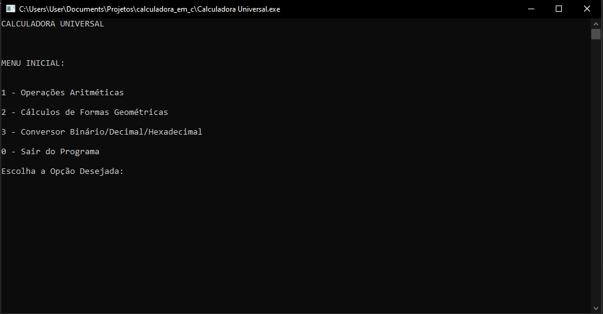

# 
 Calculadora Universal em C  &#x1F5A9; 
 
  

> Tipo de Projeto:  Pessoal &#x1F4DA; 

> Status do Projeto:  Finalizado &#10004;  

##  1. Descrição  ##

O projeto consiste em uma calculadora com diversas funcionalidades básicas feita na linguagem C, fazendo uso do prompt de comando para interagir com o usuário.

##  2. Objetivo  ##

A produção deste projeto teve início em 2020 e teve como objetivo testar meus conhecimentos, principalmente no que diz respeito à <i>Lógica de Programação</i>, adquiridos na matéria <i>"Fundamentos de Programação e Estruturas de Dados"</i>, cursada durante o 1º ano do Curso Técnico em Informática Integrado ao Ensino Médio do IFF Campus Campos Centro. Dito isto, diversas limitações e a falta de interatividade do programa se devem à minha falta de domínio e conhecimento aprofundado sobre a linguagem C, levando em conta que o objetivo principal do projeto era trabalhar Lógica de Programação com as ferramentas da linguagem que foram ensinadas durante a formação técnica.

##  3. Bibliotecas Utilizadas  ##

Na construção deste projeto, foram utilizadas as seguintes bibliotecas para atender as respectivas necessidades:

> ***stdlib.h*** (Funções básicas da linguagem)

> ***stdio.h*** (Funções de entrada e saída de dados)

> ***string.h*** (Manipulação de Strings)

> ***math.h*** (Funções Matemáticas)

> ***locale.h*** (Exibição de caracteres especiais e acentuação)

> ***windows.h*** (Congelar o programa por um determinado período de tempo)

##  4. Funcionalidades  ##

Durante o ciclo de vida do programa, é retornado para o usuário um menu de opções com uma linha de comando, onde ele poderá navegar entre as funcionalidades até iniciar uma função desejada.

*Menu Inicial do Programa*

A calculadora possui 3 principais grupos de funcionalidades:

*  Operações Aritméticas 

*  Cálculos de Formas Geométricas 

*  Conversor Binário &xharr; Decimal &xharr; Hexadecimal 

Os tópicos a seguir são dedicados a detalhar cada um dos grupos de funcionalidades citados acima.

###  4.1 Operações Aritméticas  ###

O módulo de <i>Operações Aritméticas</i> é destinado às operações básicas da matemática, utilizadas para construir e solucionar equações. Nele estão disponíveis os seguintes cálculos:

1. **Soma**
2. **Subtração**
3. **Multiplicação**
4. **Divisão**
5. **Potência**
6. **Raiz**
7. **Logaritmo**

Observação:  Para os cálculos de *Soma*, *Subtração*, *Multiplicação* e *Divisão*, é necessário informar a quantidade de operandos que devem ser calculados, enquanto as demais funções realizam apenas um cálculo por vez. 

###  4.2 Cálculos de Formas Geométricas  ###

O módulo de Cálculos de Formas Geométricas é destinado às relações matemáticas geométricas de polígonos planos e sólidos. Desta forma, ele é subdivido em 3 principais tipos de cálculos geométricos: <i><b>Perímetro</i></b>, <i><b>Área</i></b> e <i><b>Volume</i></b>. Segue abaixo a lista de formas geométricas disponíveis para cálculo em cada uma das operações:

1. **Perímetro**

* Quadrado
* Retângulo
* Triângulo
* Círculo
* Outros *(Informa-se a quantidade de lados do polígono e o tamanho de cada lado)*

2. **Área**

* Quadrado
* Retângulo
* Triângulo
* Paralelogramo
* Losango
* Trapézio
* Círculo

3. **Volume**

* Cubo
* Paralelepípedo
* Pirâmide
* Cone
* Cilindro
* Esfera

###  4.3 Conversor Binário &xharr; Decimal &xharr; Hexadecimal  ###

O módulo de Conversões é destinado a realizar conversões de um número entre os sistemas numéricos <b><i>binário</i></b>, <b><i>decimal</i></b> e <b><i>hexadecimal</i></b>. Desta forma, o usuário primeiramente deve escolher em qual sistema númerico irá informar o número e para qual sistema númerico ele deve ser convertido. 

##  5. Como acessar/utilizar o programa ?  ##

Para acessar o programa, basta realizar um desses passos: 

1. Fazer download do arquivo Calculadora_Universal.exe e executar;

2. Fazer download do arquivo Calculadora_Universal.cpp, abrir o arquivo em algum compilador de C/C++  
(Ex.: Dev-C++) e executar o código.

___